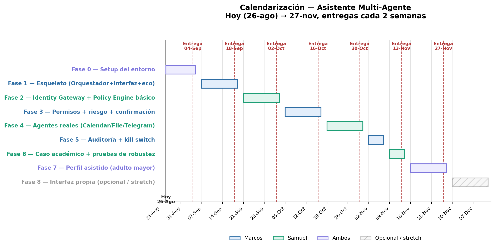

# Calendarización del Proyecto
### Hoy (26 de agosto) → Viernes 27 de noviembre — entregas cada 2 semanas

Basada en las 9 fases ya definidas en `MD2_Plan_de_Fases.md` del repo, distribuidas en el tiempo disponible con checkpoints de entrega cada 2 semanas.

---

## Tabla de fases y fechas

| Fase | Responsable | Del | Al | Entrega asociada |
|---|---|---|---|---|
| 0 — Setup del entorno | Ambos | 26-ago | 04-sep | **04-sep** |
| 1 — Esqueleto (Orquestador + interfaz + agente eco) | Marcos | 07-sep | 18-sep | **18-sep** |
| 2 — Identity Gateway + Policy Engine básico | Samuel | 21-sep | 02-oct | **02-oct** |
| 3 — Permisos + niveles de riesgo + confirmación | Marcos | 05-oct | 16-oct | **16-oct** |
| 4 — Agentes reales (Calendar / File / Telegram) | Samuel | 19-oct | 30-oct | **30-oct** |
| 5 — Auditoría + kill switch | Marcos | 02-nov | 06-nov | *(se entrega junto con Fase 6)* |
| 6 — Caso académico + pruebas de robustez | Samuel | 09-nov | 13-nov | **13-nov** |
| 7 — Perfil asistido (adulto mayor) | Ambos | 16-nov | 27-nov | **27-nov (checkpoint final)** |
| 8 — Interfaz propia *(opcional / stretch)* | A definir | 30-nov | 11-dic | Solo si sobra tiempo antes de la entrega final de diciembre |

---

## Cómo leer esto

- **Es lineal a propósito** (igual que en el MD2): cada fase depende de que la anterior esté realmente terminada y probada, no a medias — si una se atrasa, empuja a las siguientes.
- **Fase 5 es corta (1 semana)** porque es más ligera que las demás (auditoría + kill switch, sin agentes nuevos que construir) — por eso comparte checkpoint de entrega con la Fase 6.
- **El 27 de noviembre es el checkpoint donde deberían estar completas las Fases 0–7** — es decir, el MVP completo con los 2 perfiles de usuario (estudiante + adulto mayor) funcionando de punta a punta.
- **La Fase 8 (interfaz propia) queda fuera del camino crítico**, como estaba planteado desde el MD2 — se ataca después del 27 de noviembre solo si el resto quedó sólido y hay tiempo antes de la entrega final de diciembre.
- Si alguna fase se atrasa, lo primero que se sacrifica debería ser la Fase 8, nunca las Fases 0–7 — esas son las que sostienen la defensa ante la terna.

## Riesgos a vigilar

- **Fase 4 (Agentes reales)** es la más pesada — son 3 agentes distintos en 2 semanas. Si el equipo ve que se atrasa, conviene priorizar Calendar + Telegram (los que cubren los casos de uso 1 y 4 del MD1) y dejar File como el que más fácil se recorta o simplifica si hace falta tiempo.
- **Fase 7 (Perfil asistido)** depende de que las Fases 3 y 5 (permisos + auditoría) ya estén sólidas — no conviene adelantarla si esas quedaron a medias.
- Las dos semanas de colchón que darían margen real son la 30-oct y la 13-nov: si van a tiempo hasta ahí, el resto del calendario es cómodo; si van atrasados, esos dos checkpoints son la señal de alarma para replanificar antes de noviembre.
